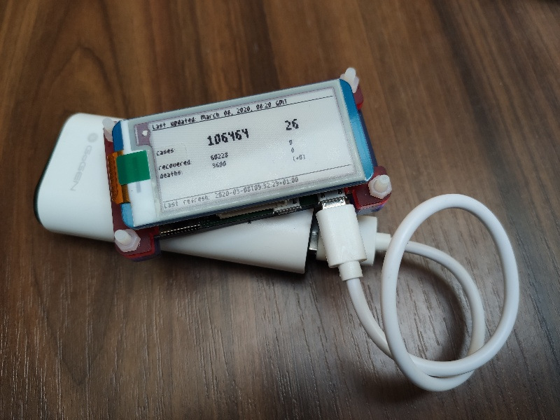

# Go-RaspberryPi-Covid-19
`Golang`

+`Raspberry Pi Zero W`

+`Waveshare 2.13 eink display`

+`SPI communication`

+`web scraping`

+`COVID-19 disease`

= **THIS**

### Resources
*Data (worldometers):* https://www.worldometers.info/coronavirus/

*Font (Daniel Linssen):* https://managore.itch.io/m3x6

### Result

*Left* = World total

*Right* = Czech Republic

